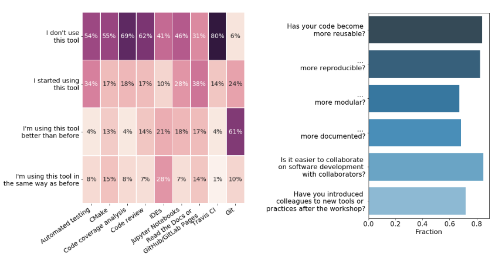

name: inverse
layout: true
class: middle, inverse

---

#### 
 CarpentryCon, Dublin 2018 

#### Thor Wikfeldt (PDC Center for High Performance Computing, Stockholm)

---

layout: false

## About the project

- Started in September 2016 as project within the Nordic e-Infrastructure Collaboration (NeIC) 
- Additional funding from national HPC organizations in the Nordics
- Second phase will start autumn 2018
-  Aim: reach sustainability after phase 2 concludes in 2021

## What we do

- Develop lesson material on best practices and tools for sustainable scientific software development
- Organize and deliver workshops around the Nordics
  - 10 regular 3-day workshops, around 250 participants so far
  - 5 other types of events (1/2 - 1 day tutorials, discussion meetings)

- Code repository hosting for research software coupled with a continuous integration service for automated testing: 
  [source.coderefinery.org](https://source.coderefinery.org/)

---

# Inspired by Software Carpentry

- Interactive, type-along lessons interspersed with exercises
- Jekyll structure and browsing layout derived from work by SWC 
- Red and green stickies, feedback at end of each day
- Under development: detailed instructor guidelines and instructor training

> 

---

# What we teach

All workshops include:
- Introductory and advanced Git
- Automated testing (Travis CI)
- Code coverage analysis (Coveralls)
- Modular code development
- Jupyter Notebooks
- Tools for reproducible research (workflow management tools, containers)
- Documentation (Sphinx, Read the Docs, GitHub Pages)
- Software licensing

Some workshops include:
- CMake
- Integrated development environments

Further differences to Software Carpentry workshops:
- We do not teach a programming language
- Most participants already write scientific software

---

# Impact

> Results from 3-6 month post-workshop survey

---

## What we have learned

- There is a **huge** demand for intermediate/advanced training in scientific software development
- 90% of learners want *more* exercises, but there's a difficult tradeoff with the amount of material that can be covered

## Future directions

- Reach scale and sustainability
 - involve volunteer instructors
 - write best practice guides and demonstrate them in short screencasts

- Closer collaboration with the Carpentries
 - coordinate workshops
 - share instructors
 - require Carpentry instructor training for new instructors
 - contribute lessons to Software Carpentry

---

# Acknowledgments

<ul>
  
  
  
  
  
  
</ul>

<ul>
<li> Radovan Bast, Tromsø, Norway </li>
<li> Bjørn Lindi, Trondheim, Norway  </li>
<li> Sri Harsha Vathsavayi, CSC IT center for science, Finland</li>
<li> Nikolai Denissov, CSC IT center for science, Finland</li>
<li> Sabry Razick, UiO University of Oslo, Norway </li>
<li> Jyry Suvilehto, CSC IT center for science, Finland </li>

</ul>

 

