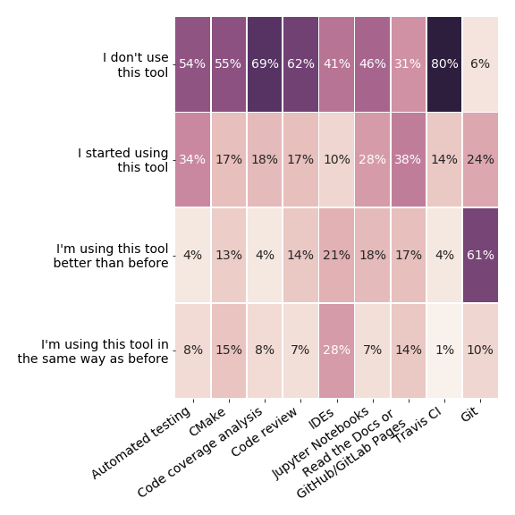

name: inverse
layout: true
class: middle, inverse

---

#### 
 CarpentryCon, Dublin 2018 

#### Thor Wikfeldt (PDC Center for High Performance Computing, Stockholm)

---

layout: false

## About the project

- Started in September 2016 as project within **NeIC**
- 2.5 FTEs spread around the Nordics
- Second phase will start autumn 2018

## What we do

- Develop lesson material on best practices and tools for sustainable scientific software development
- Organize and deliver workshops around the Nordics
  - 11 regular 3-day workshops, over 250 participants 
  - 5 other types of events (tutorials, discussion meetings)

- Code repository hosting for Nordic research software coupled with a CI service for automated testing: 
  [source.coderefinery.org](https://source.coderefinery.org/)

---

# Inspired by Software Carpentry

- Interactive, type-along lessons interspersed with exercises
- Jekyll structure and browsing layout derived from work by SWC 
- Red and green stickies, feedback at end of each day
- Under development: detailed instructor guidelines 

> 

---

# What we teach

*All* workshops include:

<ul>
<li> Git
<li> Automated testing 
<li> Code coverage analysis
<li> Modular code development
</ul>

<ul>
<li> Jupyter Notebooks
<li> Tools for reproducible workflows
<li> Documentation
<li> Software licensing
</ul>

Some workshops include:
<ul>
<li> CMake</li>
<li> Integrated development environments</li>
</ul>
Also different from Software Carpentry:
<ul>
<li> We do not teach languages</li>
<li> Most participants already write scientific software</li>
</ul>

---

# Impact

- Results from 3-6 month post-workshop survey

- Encouraging results!
---

# What we have learned

- There is a **huge** demand for intermediate/advanced training in scientific software development  

- 90% of learners want *more* exercises (but difficult tradeoff with the amount of material that can be covered)  

- Learners like collaborative exercises (pairs or groups)  

- Important to give learners time to experiment instead of rushing

- Post-workshop survey works well and guides improvements of lessons

- Motivated local contact person, and quality of lecture room, important for workshop success  

.center[

]
---

# Future directions

- Reach scale and sustainability
 - involve volunteer instructors
 - write best practice guides and demonstrate them in short screencasts
 - aim: reach sustainability after phase 2 concludes in 2021

- Closer collaboration with the Carpentries
 - coordinate workshops - define training levels
 - share instructors 
 - contribute lessons to Software Carpentry

## **Invitation**  
CodeRefinery lesson material is open source (CC BY-SA 4.0) and can be used/improved by anyone
  - [coderefinery.org/lessons/](http://coderefinery.org/lessons/)
  - All feedback highly welcome!
  - @coderefine, support@coderefinery.org
---

# Acknowledgments

<ul>
  
  
  
  
  
  
</ul>

<ul>
<li> Radovan Bast, Tromsø, Norway </li>
<li> Bjørn Lindi, Trondheim, Norway  </li>
<li> Sri Harsha Vathsavayi, CSC IT center for science, Finland</li>
<li> Nikolai Denissov, CSC IT center for science, Finland</li>
<li> Sabry Razick, UiO University of Oslo, Norway </li>
<li> Jyry Suvilehto, CSC IT center for science, Finland </li>

</ul>

 

<ul>
<li>This presentation was created in cicero (http://cicero.xyz/) </li>
<li>Slides on https://github.com/wikfeldt/shorttalk-coderefinery </li> 

